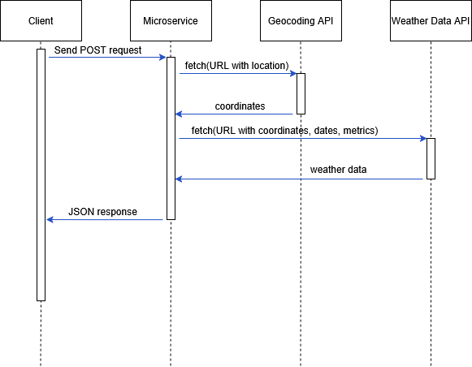

# SETUP

(No npm installation required.)

Geocoding API key:
You can sign up on https://openweathermap.org to get an API key. 
The server is currently using a free tier API key, which allows 
60 lookups per minute.

Weather data API key:
Currently, you don't need one to use URL API from open-meteo.

# HOW TO REQUEST DATA

Start the microservice.
    node weatherService.js

Send a POST to this endpoint:
http://localhost:36199/fetchWeatherData
The POST body should be a JSON such as the following, containing these fields:
{
  city: 'Corvallis',
  state: 'OR',                 // can be written out or abbreviated, or left as empty string
  country: 'US',               // can be written out or abbreviated
  startDate: '2025-05-31',     // 'YYYY-MM-DD' format
  endDate: '2025-06-04'        // 'YYYY-MM-DD' format
}

See the example below about how to handle setting up the request and options,
and send the POST request.

## EXAMPLE

const http = require('http');

// Prepare request payload
const postData = JSON.stringify({
  // Change these values for your query
  city: 'Corvallis',
  state: 'OR',
  country: 'US',
  startDate: '2025-05-31',
  endDate: '2025-06-04'
});

// Prepare request options
const options = {
  hostname: 'localhost',
  port: 36199,
  path: '/fetchWeatherData',
  method: 'POST',
  headers: {
    'Content-Type': 'application/json',
  }
};

// Send the request
const req = http.request(options, (res) => {
  // See next section for how to receive data
});

req.on('error', (e) => {
  console.error(`Request error: ${e.message}`);
});

req.write(postData);
req.end();

# HOW TO RECEIVE DATA

After sending the request, your program will automatically receive a response 
from the microservice. The response will be in JSON format and includes 
the geocoded location (to confirm to you that it got the right location), 
forecast data, and historical weather data.

See the example below to handle the response, check for errors, and 
parse the JSON payload.

## EXAMPLE

// This is the same req as above, but filled in.
const req = http.request(options, (res) => {
  // Receive payload
  let data = '';
  res.on('data', chunk => { data += chunk; });
  res.on('end', () => {
    if (res.statusCode !== 200) {
      try {
        const errObj = JSON.parse(data);
        console.error(`Server Error (${res.statusCode}):`, errObj.error || errObj);
      } catch {
        console.error(`Server Error (${res.statusCode}):`, data);
      }
      return;
    }
    // Parse data
    try {
      parsedData = JSON.parse(data);
      // Do something with this data.
      // Location is mostly here to confirm geocoding got the correct location.
      console.log('Location:', parsedData.location);
      console.log('Forecast:', parsedData.forecast);
      console.log('History :', parsedData.history);
    } catch (err) {
      console.error('Failed to parse JSON from server:', data);
      return;
    }
  });
});

# UML Sequence Diagram

